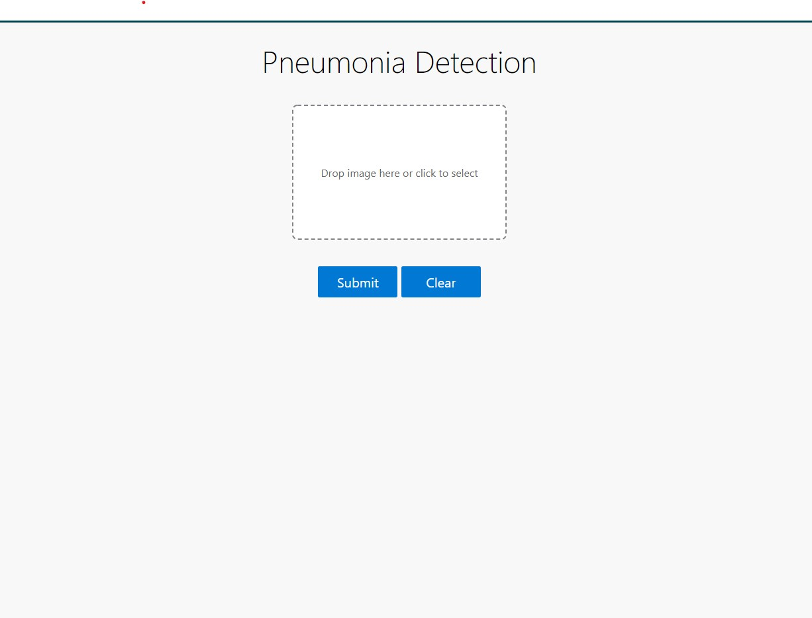
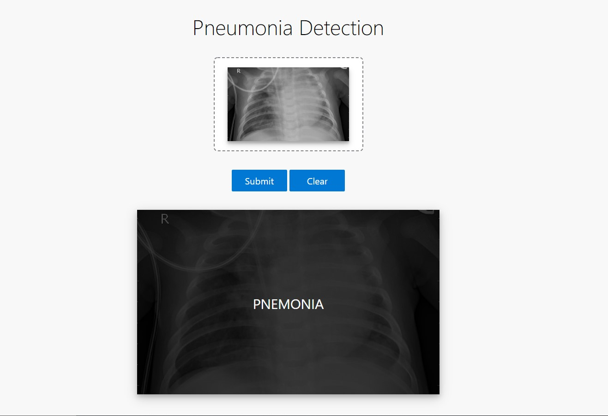

# Flask Web-App Pneumonia Detection from Chest X-Ray Images CNN 
A Flask **pneumonia detection** web application 

## Setting up the Web-App Locally 

1. Clone The Repository or Download Zip from  <https://github.com/YashShende/Pneumonia_Detection/archive/master.zip> & Extract it.

2. Install Requirements  `pip install -r requirements.txt`

3. To run the app on localhost run `python app.py`

4. app is running at `http://127.0.0.1:5002`

#### Dataset
<pre>

Dataset Name : Chest X-Ray Images (Pneumonia)

Dataset Link : https://www.kaggle.com/paultimothymooney/chest-xray-pneumonia
           
</pre>

#### Model 
<pre>
In this Project i Trained my model on Google Colab and saved model in Models Folder.
You can put your trained model inside the Models folder to get better results just 
keep in mind the dimenssions of image feed to trained model if you want to take a 
look how i trained my model check this link 
</pre>
#### Link : <https://colab.research.google.com/drive/1RrHsRmCa-V9EtZQRI0HnnVoaN9j8A5qk>

## WebApp 
#### Home Page 

#### Prediction

